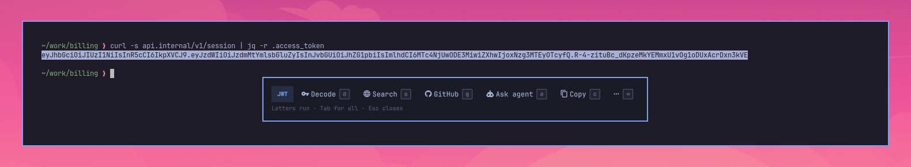
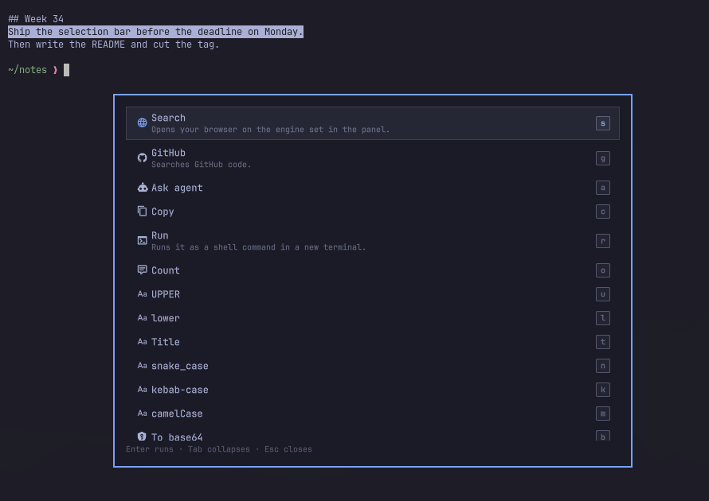
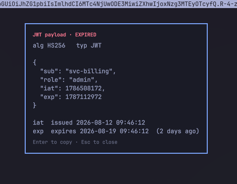
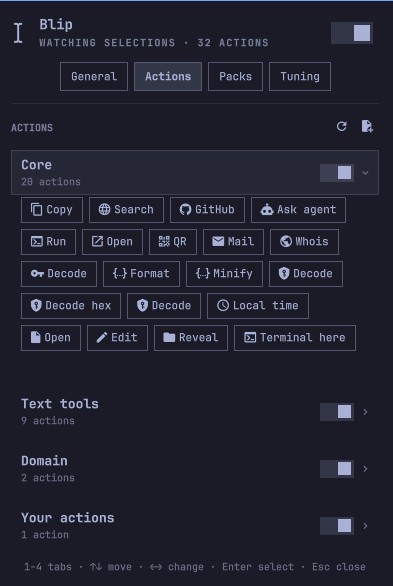

# Blip

Select text anywhere in [Omarchy](https://omarchy.org/) and a small themed bar
appears over it with the actions that fit what you selected. It works in a
terminal, a browser, an editor, a chat window.



A URL gets Open and QR. A JWT gets Decode with the expiry flagged. Minified JSON
gets Format. A file path gets Open, Edit, Reveal, Terminal here. Anything at all
gets Search, GitHub and Ask agent, with Copy behind them.

Some selections are answered on the bar itself, before you press anything. A
Unix timestamp shows its local time, `23*4+18` shows `= 110`, `#1e88e5` shows
`rgb(30, 136, 229)` next to a live swatch, `100 mi` shows `→ 160.93 km`. Click
the answer, or press `=`, to copy it.

The transforms write back. Select `helloWorld` in your editor, pick
`snake_case`, press `Enter`, and the buffer now reads `hello_world`: the result
pastes over the selection in the app it came from. Formatted JSON lands back in
the file it was minified in, decoded base64 lands where the blob was. `c`
copies instead, `Esc` walks away, and the result is on the clipboard either
way, so a window that cannot take the paste costs you nothing.

## Install

```bash
omarchy plugin add https://github.com/yogeshojha/blip.git --enable --yes
sudo pacman -S --needed wl-clipboard wtype qrencode jq inotify-tools
```

A keybind, in `~/.config/hypr/bindings.lua`:

```lua
o.bind("SUPER + ALT + B", "Blip", "omarchy-shell blip trigger")
```

One key does three things: shows the bar for the current selection, hands it
the keyboard if it is already up, closes it if it already has the keyboard.

## Use

Select something. The bar fades in just above the pointer, flips below it when
there is no room, and never takes focus. Move the pointer well away and it
closes; leave it alone and it fades after a few seconds. Click elsewhere and it
closes. Right-click and it is gone before the app's own menu is up — the click
passes straight through to the app.

| Key | |
|---|---|
| a letter on a chip | run that action |
| `←` `→` | move |
| `↑` `↓` | dismiss — in the overflow, move |
| `Enter` | run the highlighted action |
| `=` | copy the instant answer, when there is one |
| `Tab` | show everything, including the overflow |
| `Esc` | back out one level, then close |

Only the letters printed on the chips are taken — and `Enter`, once `←` `→`
have highlighted something. Every other key dismisses the bar and lands in the
window you selected in, so `↑` still reaches your shell history, `Enter` still
sends your message, and typing carries on where it was going.



In a result (a decoded token, a formatted document, a QR code), `Enter` copies
and `Esc` closes. When the result rewrites the selection — a case change,
formatted JSON, a decode — the card shows the result with **Replace** and
**Copy**: `Enter` pastes it back over the text you selected, `c` copies it
instead. A stray `Space` only ever copies; nothing rewrites your text but a
deliberate `Enter` or a click on Replace.

## What ships

| Selection | Actions |
|---|---|
| anything | Search · GitHub · Ask agent · Copy · Run |
| url | Open · QR |
| email | Mail · QR |
| ip | Whois |
| jwt | Decode, expiry flagged |
| json | Format · Minify |
| base64 / hex / percent-encoded | Decode |
| epoch | Local time |
| path | Open · Edit · Reveal · Terminal here |
| text | Count · UPPER · lower · Title · snake_case · kebab-case · camelCase · To base64 · Percent-encode |

`Run` asks before it runs anything. `Whois` stays hidden until you allow
network actions.

Detection validates rather than guesses: `Decode` appears only on a JWT whose
header and payload really parse, `and/or` and `24/7` are not paths, a clock is
not an IPv6 address, prose that mentions an error is not an error, and a
lowercase word that happens to decode is not base64.



## Add your own

Drop a `.jsonc` in `~/.config/omarchy/blip/actions/`. No code, no restart.

```jsonc
{
  "id": "acme.jira",
  "label": "Ticket",
  "icon": "󰠮",
  "when": { "matches": "^[A-Z]{2,10}-[0-9]+$" },
  "run": { "exec": ["xdg-open", "https://jira.acme.com/browse/${text}"] }
}
```

An action can also pipe the selection through a script, call another plugin over
IPC, ship as a pack, or replace one of Blip's own.
**[ACTIONS.md](ACTIONS.md)** is the full reference.

## Search

`Search` opens DuckDuckGo by default. The control panel offers Google, Brave
and Kagi, or takes a url of your own with `%s` where the selection goes:

```
https://lobste.rs/search?q=%s
```

Blip's own `${enc}` works there in place of `%s`, as do `${text}` and `${type}`,
so a custom search can key off what was detected. A url with no placeholder is
refused; Search falls back to DuckDuckGo.

`GitHub` sits beside it on `g` and goes straight to GitHub code search, which
wants you signed in.

## Control panel



Click the bar icon and the whole panel fits in one view: the armed switch, the
behaviour toggles, the search engine, and a row per module. A module opens into
a grid of chips — the same chips the bar shows — and clicking one turns that
action off or on, so you can drop the text tools, or just `Run`, without
touching a file; the module's switch, or `Space`, flips them all at once. Packs
install from a pasted git URL and update or remove from the same fold, and
installing or removing one asks first — see
[ACTIONS.md](ACTIONS.md#action-packs) — and the sliders sit folded under
*Fine-tuning*, values readable on the closed row. `↑↓` move, `←→` fold and
unfold, `Enter` selects. Right-click the icon to arm and disarm without opening
it; middle-click shows the bar for the current selection. A keybind opens it
too: `omarchy-shell blip-panel toggle`.

`Setup > Plugins > Blip` holds the same settings. Hide the icon with the *Show
the bar icon* setting rather than by removing the widget from the bar: the
entry in `shell.json` is what keeps the plugin enabled.

## Remove

```bash
omarchy plugin remove io.github.yogeshojha.blip
```

That takes the plugin and its bar entry. Your actions and what you allowed live
in `~/.config/omarchy/blip/`; delete that too if you want nothing left behind.

## Privacy

- Selections are never written to disk and never logged. They go from
  `wl-paste` into the shell's memory and no further.
- Nothing is sent anywhere by default. An action that transmits the selection
  must declare `network: true`. Those stay hidden until you allow network
  actions, and Blip asks before the first send, naming the action and the host.
  `omarchy-shell blip forget` clears what you allowed. Handing the selection to
  an app you can see, such as your browser or your agent, is not gated.
- Scripts and the clipboard get the selection on stdin. `exec` actions expand
  it into their argv, where it is visible in the process table while the
  command runs.
- Password managers are skipped by window class and title, and so is any
  selection a client marks sensitive.
- Screen sharing disarms Blip. No bar appears over a recording or a call.
- Blip binds keys in Hyprland while the bar is up, so an unfocused surface can
  still hear them, and right-click for as long as it is armed. Every bind passes
  the press through to the window underneath, and all of them go when you
  disarm, disable, or remove Blip.

## Development

```bash
git clone https://github.com/yogeshojha/blip.git && cd blip
node test/run.js
omarchy plugin validate .
```

`Detect.js`, `Actions.js`, and `Transforms.js` are pure, with no QML and no IO.
`Service.qml` watches and orchestrates, `Popup.qml` is the layer-shell surface,
`Runner.qml` executes, `BarWidget.qml` is the indicator and the control panel.

To run a working copy:

```bash
rsync -a --delete --exclude .git --exclude test . ~/.config/omarchy/plugins/io.github.yogeshojha.blip/
omarchy-restart-shell
```

QML changes need that restart. Action files under `~/.config/omarchy/blip/` do
not; they reload as you save. Logs are `journalctl -t omarchy-shell -f`.

## Licence

MIT.
